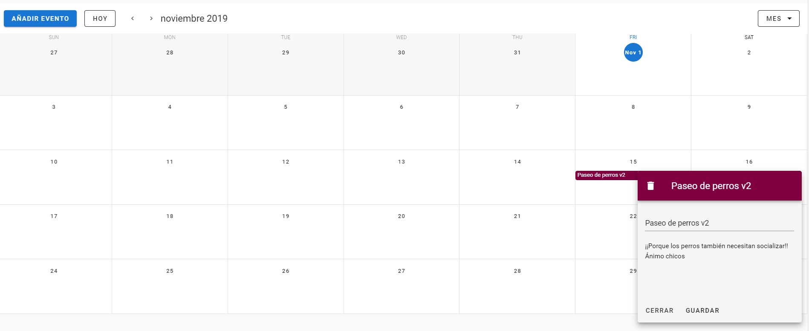

# calendar-vuejs

Calendario realizado con vuejs, vuetify y firebase

[Prueba el calendario aquí](https://www.google.com)



## Instalar dependencias
```
yarn install
```
### Añadir claves de firebase
Añadir claves en el archivo './main.js'
```javascript
const firebaseConfig = {
  apiKey: "SU API KEY XXXXXX",
  authDomain: "SU DOMINIO AUTH XXXXX",
  databaseURL: "SU URL DE LA BASE DE DATOS XXXXXX",
  projectId: "SU PROJECT ID",
  storageBucket: "SU STORAGE",
  messagingSenderId: "ID",
  appId: "APP ID"
};
```

### Lanzar servidor
```
yarn serve
```

### Compilar para producción
```
yarn build
```
